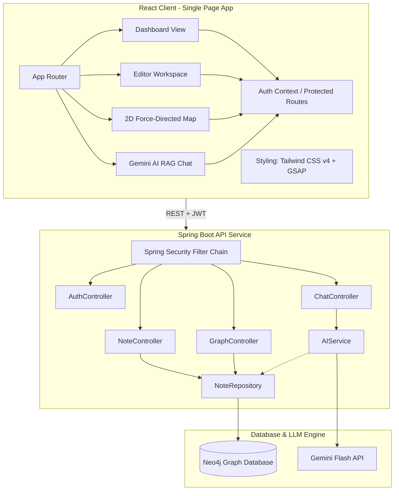

# 🧠 Second Brain AI — Personal Knowledge Substrate & Semantic Neural Map

Second Brain AI is a cutting-edge, self-hosted personal knowledge base and productivity workstation. Unlike conventional linear note-taking applications, Second Brain AI structures your thoughts, tags, and projects as a **highly connected neural graph** using a graph database (**Neo4j**) and integrates **Gemini AI** for conversational cognitive support and automatic semantic synapses.

The interface is built to be clean, immersive, and premium, utilizing dark glassmorphism, responsive dashboard statistics, and smooth GSAP transitions.

---

## 🎨 Visual & Immersive Previews

| Interactive Neural Map | Clean Dashboard & AI Chat |
|:---:|:---:|
| A dynamic 2D force-directed graph rendering explicit links and AI-discovered semantic synapses between notes. | A premium glassmorphic dark theme dashboard showing active project progress, note tags, and direct RAG-based AI chat. |

---

## 🚀 Key Features

*   **🧠 Neural Knowledge Graph (Neo4j)**
    *   Expose and visualize your thoughts as an interactive force-directed graph (`react-force-graph-2d`).
    *   **Explicit Connections**: Directly relate notes to other notes (e.g., "Note A refers to Note B").
    *   **Semantic Synapses**: The backend automatically parses keywords and creates real-time, dynamic links between independent notes that share semantic tags or related topics.
*   **🤖 Context-Aware AI Chat (RAG)**
    *   A dedicated conversational AI panel integrated with the **Google Gemini API** (`gemini-flash-latest`).
    *   Retrieves recent and relevant notes to compile a localized **Knowledge Substrate** system prompt, allowing the AI to answer questions directly grounded in your private notes.
*   **📊 Analytics & Insights Dashboard**
    *   Real-time metrics tracking: Total notes written, active projects, cognitive loads, and tag distributions.
    *   Visual status gauges for active projects and tag-frequency breakdowns.
*   **📝 Markdown-First Editor**
    *   Full-featured editor featuring live markdown rendering, code block syntax highlighting, and tags.
    *   Set links to related notes, assign them to high-level projects, and edit with ease.
*   **🔐 Spring Security & JWT**
    *   Custom security filter chain and Stateless JWT token generation.
    *   User details service storing credentials securely within the Neo4j database.
*   **🐳 Multi-Stage Containerization**
    *   A clean, optimized `Dockerfile` for multi-stage Java builds.
    *   One-click local orchestration utilizing `docker-compose.yml` for local Neo4j database configurations.

---

## 🏗️ Architecture Design



---

## 🛠️ Technology Stack

| Domain | Technologies | Description |
|---|---|---|
| **Frontend Core** | React 19, TypeScript, Vite | Fast, modern, and type-safe SPA execution. |
| **Styling & FX** | Tailwind CSS v4, GSAP | Glassmorphic interface with advanced custom keyframes (`neural-drift`). |
| **Graph View** | `react-force-graph-2d` | Interactive Canvas-based WebGL graph rendering. |
| **Backend Core** | Spring Boot 3.x, Java 17 | High-performance enterprise Java web services. |
| **Database** | Neo4j Graph DB | Native property graph modeling relationships perfectly. |
| **Security** | Spring Security 6, JWT | Secure stateless authentication & route guards. |
| **AI Subsystem** | Google Gemini API (Flash-latest) | Powering the dynamic RAG Chat & Knowledge Synthesis. |
| **Deployment** | Docker, Docker Compose, Render | Multi-stage packaging and production readiness config. |

---

## ⚙️ Environment Configurations

Create a `.env` file in the root of the project or specify these env variables on your deployment environment.

### Backend Configurations (`backend/src/main/resources/application.properties`)
```properties
# Neo4j Server Settings
NEO4J_URI=bolt://localhost:7687  # or neo4j+s:// if using AuraDB
NEO4J_USERNAME=neo4j
NEO4J_PASSWORD=your_password

# JWT Authentication
jwt.secret=your_super_secret_jwt_key_64_characters_long
jwt.expirationMs=86400000

# AI Configuration
GEMINI_API_KEY=your_gemini_api_key
```

### Frontend Configurations
*   The frontend communicates with the backend via `axios` targeting `http://localhost:8080/api`. Ensure CORS is handled correctly (the backend controllers have `@CrossOrigin(origins = "*")` configured).

---

## 🚀 Setup & Installation Guide

### Prerequisites
- **Java JDK 17** or higher
- **Node.js v18+** & npm
- **Docker & Docker Compose** (highly recommended for local database setup)

### Step 1: Fire up the Neo4j Database
Utilize the root `docker-compose.yml` to boot a pre-configured Neo4j database:
```bash
docker-compose up -d
```
This spins up:
- Neo4j Bolt Protocol on `localhost:7687`
- Neo4j Web Console on `http://localhost:7474` (Default Auth: `neo4j` / `password`)

### Step 2: Configure and Start the Backend
1. Open a terminal in the `backend` folder:
   ```bash
   cd backend
   ```
2. Build the project using Maven wrapper:
   ```bash
   ./mvnw clean install
   ```
3. Run the Spring Boot application:
   ```bash
   # Make sure to set environment variables or pass them as parameters:
   export NEO4J_URI=bolt://localhost:7687
   export NEO4J_USERNAME=neo4j
   export NEO4J_PASSWORD=password
   export GEMINI_API_KEY=your_key_here
   ./mvnw spring-boot:run
   ```
   The backend will start listening on port `8080`.

### Step 3: Configure and Start the Frontend
1. Open a new terminal in the `frontend` folder:
   ```bash
   cd frontend
   ```
2. Install the package dependencies:
   ```bash
   npm install
   ```
3. Start the Vite development server:
   ```bash
   npm run dev
   ```
4. Access the web interface at `http://localhost:5173`.

---

## 📦 Production Deployment

### Backend Deployment (Render / Docker)
The repository contains a `render.yaml` configuration for native Java deployment on Render:
- **Build Command**: `./mvnw clean package -DskipTests`
- **Start Command**: `java -jar target/*.jar`
- Make sure to bind your `NEO4J_URI`, `NEO4J_USERNAME`, `NEO4J_PASSWORD`, and `GEMINI_API_KEY` env variables in the Render dashboard.

Alternatively, you can build and run the multi-stage Docker container:
```bash
docker build -t second-brain-backend ./backend
docker run -p 8080:8080 -e NEO4J_URI=... second-brain-backend
```

### Frontend Deployment (Vercel / Netlify)
The frontend project includes a `vercel.json` file for automatic SPA rewrite handling.
1. Build the production package locally or in CI:
   ```bash
   npm run build
   ```
2. Deploy the resulting `dist` folder to your chosen static hosting provider.

---

## 📂 Project Structure

```text
├── backend/                       # Spring Boot Application Root
│   ├── src/main/java/com/secondbrain/backend/
│   │   ├── controller/            # REST Controllers (Auth, Notes, Graph, Chat)
│   │   ├── dto/                   # Request/Response Data Transfer Objects
│   │   ├── model/                 # Neo4j Entity Classes (@Node, @Relationship)
│   │   ├── repository/            # SDN Repositories (Neo4j Repository interfaces)
│   │   ├── security/              # JWT & Spring Security Filters
│   │   └── service/               # AIService (Gemini RAG), Dashboard logic
│   ├── Dockerfile                 # Multi-stage Java Docker Image config
│   └── pom.xml                    # Maven Dependency Manifest
│
├── frontend/                      # React SPA Web Application
│   ├── src/
│   │   ├── components/            # Views (Dashboard, Editor, Graph, Chat, Settings)
│   │   ├── context/               # Global Authentication & Modal States
│   │   ├── ProtectedRoute.tsx     # Session Guard Wrapper
│   │   ├── App.tsx                # Main App Router & Layout System
│   │   ├── index.css              # Custom styles & Neural Drift keyframes
│   │   └── main.tsx               # Client entry point
│   ├── tailwind.config.js         # Tailwind configuration
│   ├── vite.config.ts             # Vite server pipeline
│   └── vercel.json                # Single-page-app routing rules
│
├── docker-compose.yml             # Local Neo4j container composition
└── render.yaml                    # Production Render Blueprint schema
```

---

## 📄 License
This project is licensed under the MIT License. See the LICENSE file for details.
